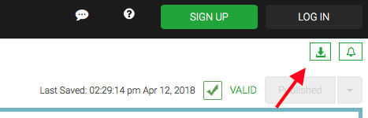

# Nationwide APIs

We have provided sample API with test data that you can access.

The APIs are documented using Swagger which provides a visualization of the API and provides a test client to try them out.

Swagger: https://app.swaggerhub.com/apis/NationwideInsurance/Hackathon-May-2018

You can also export a client bundle in your preferred language to get started.

> **Note** The base url for the provide APIs is http://nw-angelhack-2018-mocks.us-east-1.elasticbeanstalk.com/

## Advanced

If you want expand the existing dataset to meet your scenarios or add additional APIs you can run them locally or on your own server.

We are using a Node package called json-server to easily as JSON file as an API.

### Running Mocks

The mocks are run by using json-server: https://github.com/typicode/json-server.

Install by running `npm i -g json-server`

Then run by running `json-server --watch demo.json`

### Generated Additional Test Data

You can update the demo.json file directly to add your variations using the json-server defined pattern.

We have also provided a generarator that can be used to promatically add additional data to the file.
The generator is defined using typescript.

The recommended way to run typescript files, is to install ts-node: `npm i -g ts-node`.  
You can then run the generator by running `ts-node generateMocks.ts`
